# Anisotropic Mobility

The anisotropic mobility module calculates and visualizes direction-dependent charge carrier mobility from crystal packing information and hopping parameters.

It is intended for molecular crystals where charge transport is described as hopping between neighboring molecules.

## Basic Workflow

1. Select a center molecule.
2. Add neighboring molecular pairs.
3. Enter reorganization energy and electronic coupling values.
4. Define the reference plane.
5. Generate directional mobility plots and export results.

## 1. Select the Center Molecule

Open a crystal structure, make molecules whole if needed, then select the molecule used as the center of the packing analysis. In the module window, use **Use Selection** to register the selected molecule.

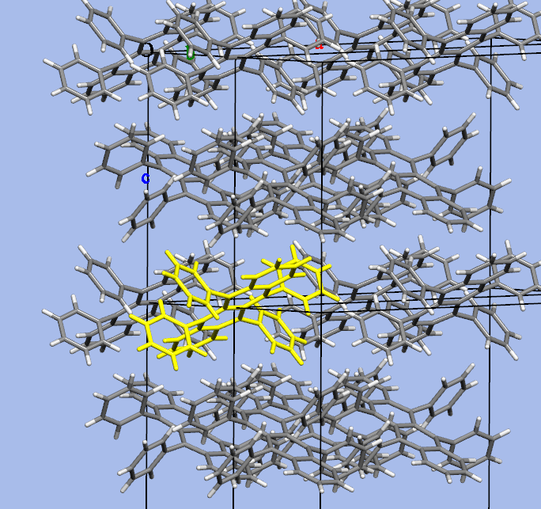

## 2. Add Packing Pairs

Select a neighboring molecular pair that includes the center molecule, then add it to the packing-pair table. Repeat this for all relevant neighboring pairs.

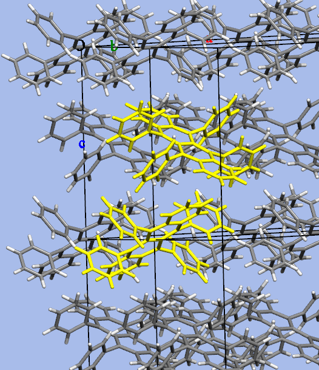

Each pair stores the parameters used by the mobility model:

- `lambda`: reorganization energy in eV
- `V`: electronic coupling in eV
- `R`: centroid distance in angstrom
- `theta`: in-plane angle relative to the reference axis
- `gamma`: out-of-plane tilt relative to the selected crystal plane
- `W`: hopping rate
- `W_i`: normalized hopping probability contribution

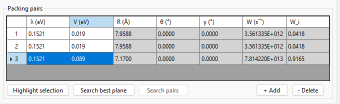

## 3. Define the Reference Plane

Use **Search best plane** or set the plane manually. The reference plane defines how molecular-pair vectors are projected into a 2D transport map. For common crystal analysis this is often the `ab` plane, but the correct choice depends on the crystal and the intended comparison.

The reference axis controls the zero-angle direction of the polar plot. If automatic reference-axis selection is enabled, the module chooses an axis from the current plane information.

The advanced page controls plane-search and output settings such as whether only main `hkl` planes are used, search depth, export size, and angular step.

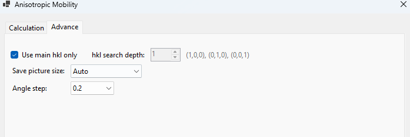

## 4. Generate and Export Results

The module displays a polar mobility plot. Right-click the plot to export a picture or the underlying data when export commands are available.

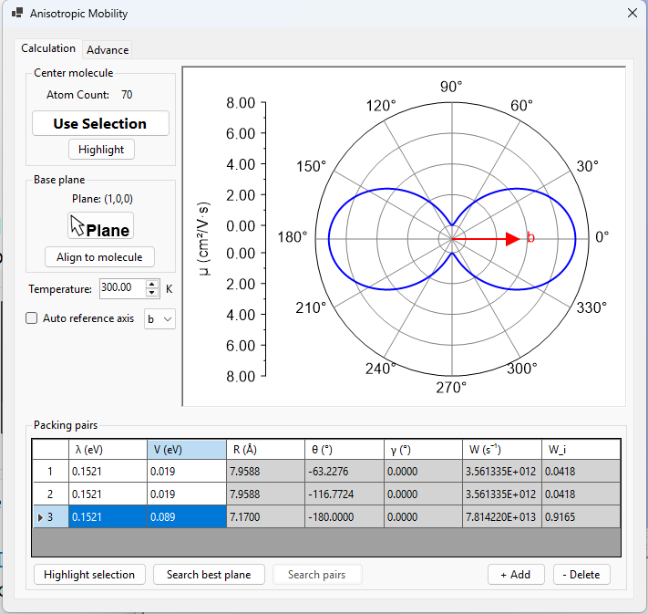

## Theory

The workflow follows the charge hopping model used in studies of anisotropic mobility in organic semiconductor crystals. The older TheoChem Lab help files referenced:

Shu-Hao Wen, Ai Li, Jian Song, Wen-Qing Deng, Ke-Li Han, and William A. Goddard III, "First-principles investigation of anisotropic hole mobilities in organic semiconductors", *Journal of Physical Chemistry B*, 2009, 113, 8813-8819.

The hopping rate `W` is calculated from a Marcus-Hush expression using electronic coupling `V`, reorganization energy `lambda`, temperature `T`, and the Boltzmann constant `k_B`.

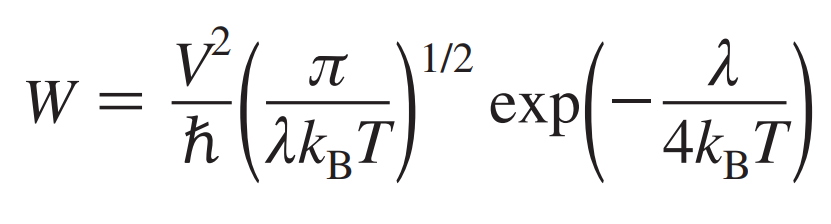

For example, with `V = 0.08 eV`, `lambda = 0.15 eV`, and `T = 300 K`, the older help calculation gives a hopping rate of approximately `6.49 x 10^13 s^-1`.

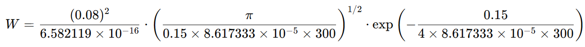

For each packing path, the hopping probability is normalized from the individual hopping rates.

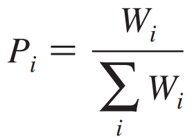

The diffusion coefficient is estimated from the molecular-pair displacement vectors and their hopping probabilities.

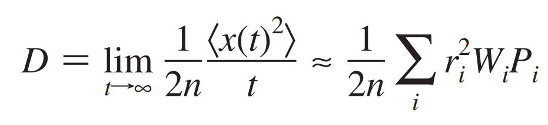

Mobility is then related to diffusion through the Einstein relation.

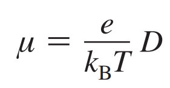

The directional mobility is obtained by summing the contribution of each hopping path after projecting it into the selected plane and reference direction.

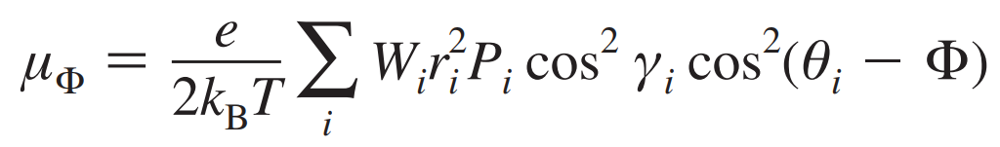

In this expression:

- `r_i` is the centroid vector between the center molecule and neighbor `i`
- `P_i` is the normalized hopping probability for path `i`
- `gamma_i` is the out-of-plane tilt angle
- `theta_i` is the in-plane azimuthal angle
- `Phi` is the direction in which mobility is evaluated

## Practical Notes

The result is only as reliable as the molecular-pair list and the parameters supplied for each pair. Before comparing plots, confirm that the same plane convention, temperature, and pair-selection strategy were used.

Temperature is part of the hopping-rate calculation, so changing it changes all derived rates and mobility values.

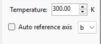
